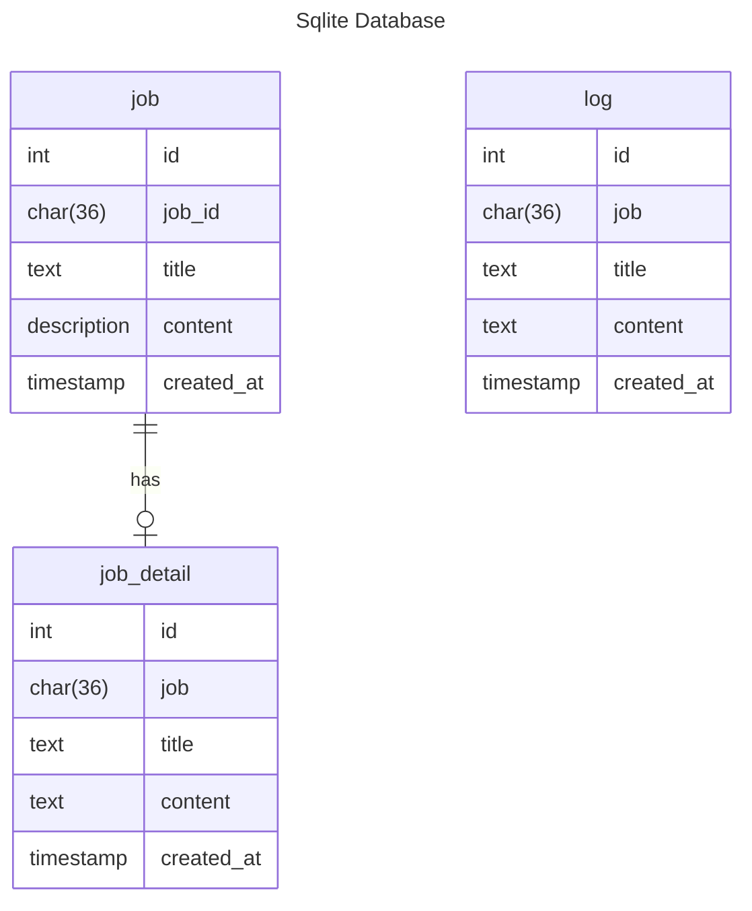

# Verteilen 2 Client Database

Here are formats of the database

### Table: log

The system or background task log.

### Table: job

Whenever the agent is executing a job or service, \
it will create a job table to record it

### Table: job_detail

The messages when running the job or service.