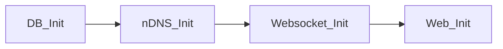

# Verteilen 2 Client Workflow

## Initialization

```mermaid
flowchart LR
    DB_Init --> nDNS_Init
    nDNS_Init --> Websocket_Init
    Websocket_Init --> Web_Init
```

Check the main.cpp, you will see something like this.